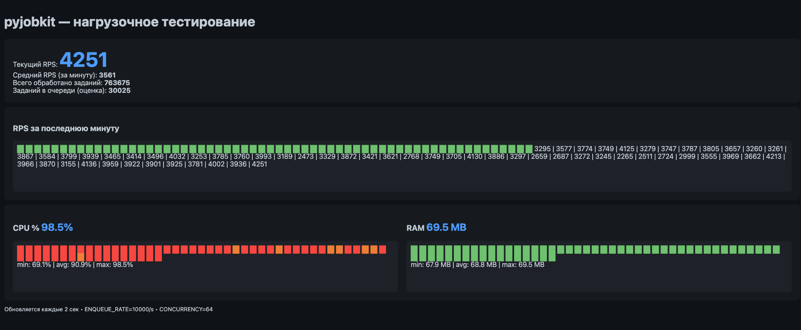

# pyjobkit-loadtest

Load testing benchmark for [pyjobkit](https://github.com/4stm4/pyjobkit) with real-time web dashboard.

## Features

- 📊 **Web dashboard** with RPS, CPU, and RAM charts
- 🚀 **High performance** — up to 6000+ RPS with FastQueueBackend
- 🔨 **Real workload** — SHA256 hashing with verifiable results
- 🔴 **Redis integration** — task counter persistence
- 📈 **Resource monitoring** — real-time CPU and RAM tracking

## What We Measure

Each task performs **real CPU-bound work**:

```python
def compute_work(data: str, iterations: int) -> str:
    result = data.encode()
    for _ in range(iterations):
        result = hashlib.sha256(result).digest()
    return result.hex()
```

- **Deterministic** — same input always produces same output
- **Verifiable** — hash is checked after each task
- **Configurable** — adjust `HASH_ITERATIONS` for heavier workload

This is NOT a no-op benchmark. Every RPS represents actual SHA256 computations.

## Quick Start

### With Docker Compose (recommended)

```bash
docker compose up --build
```

Open the dashboard: [http://localhost:8888](http://localhost:8888)

### Locally

1. Install dependencies:

```bash
cd pyjobkit-loadtest
python3 -m venv venv
source venv/bin/activate
pip install fastapi uvicorn psutil redis pyjobkit jinja2
```

2. Start Redis:

```bash
docker run -d -p 6379:6379 redis:7-alpine
```

3. Run the benchmark:

```bash
cd benchmark
DSN=redis://localhost:6379/0 ENQUEUE_RATE=10000 CONCURRENCY=64 HASH_ITERATIONS=100 python web.py
```

4. Open [http://localhost:8888](http://localhost:8888)

## Configuration

| Variable | Default | Description |
|----------|---------|-------------|
| `DSN` | `memory://` | Redis URL or `memory://` for no-Redis mode |
| `ENQUEUE_RATE` | `200` | Task enqueue rate per second |
| `CONCURRENCY` | `8` | Number of parallel workers |
| `HASH_ITERATIONS` | `100` | SHA256 iterations per task (CPU load) |
| `REAL_WORK` | `1` | Set to `0` for no-op tasks (max throughput test) |

## Architecture

```
┌─────────────┐    ┌─────────────┐    ┌─────────────┐
│  Enqueuer   │───▶│ MemoryQueue │───▶│   Worker    │
│ (rate/sec)  │    │  (pyjobkit) │    │(concurrency)│
└─────────────┘    └─────────────┘    └──────┬──────┘
                                             │
                                             ▼
                                      ┌─────────────┐
                                      │    Redis    │
                                      │ (INCR/100)  │
                                      └─────────────┘
```

- **FastQueueBackend** — asyncio.Queue with O(1) operations (10x faster than MemoryBackend)
- **HashExecutor** — real CPU work with SHA256 hashing
- **Metrics** — RPS, CPU%, RAM collection in deque (60 seconds)

## Performance

Results on Mac Mini M1, 8 cores:

| HASH_ITERATIONS | RPS | CPU | Description |
|-----------------|-----|-----|-------------|
| 100 | ~5000-6000 | 90-99% | Light workload |
| 1000 | ~800-1000 | 95-99% | Heavy workload |
| 0 (REAL_WORK=0) | ~6000-7000 | 85-97% | No-op (max throughput) |

## Screenshot



## Requirements

- Python 3.11+
- pyjobkit 0.2.0
- Redis 7+ (optional)
